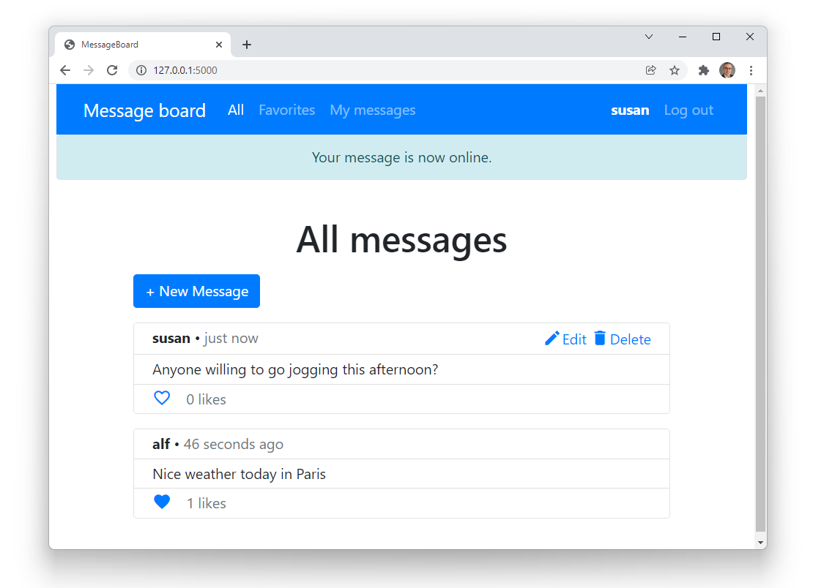

# message board application using Flask

This is a final project for Harvard's course [CS50x](https://cs50.harvard.edu/x/2022/).

The application provides functionality to:

1. register, log in and log out
2. display messages, starting with the most recent ones
3. add new messages
4. edit and delete a user's own messages
5. mark/unmark messages as favorites

Users must log in to be able to add, edit or delete 
messages, and to mark/unmark messages as favorites.

A user can only edit and delete their own messages.

## Quickstart on Windows:  
+ Get into the project folder    
    `cd message-board`
+ Create and activate your virtual environment  
    `py -m venv venv`  
    `venv\Scripts\activate`
+ Install the required libraries. Make sure your virtual environment is activated  
    `pip install -r requirements.txt`
+ Create a `.env` file and store your SECRET_KEY inside:  
    `SECRET_KEY=my-long-secret-key`
+ Create the database to store messages 
    `flask db upgrade`
+ Launch the development server  
    `flask run`
+ Visit `http://127.0.0.1:5000/`, register and start posting messages